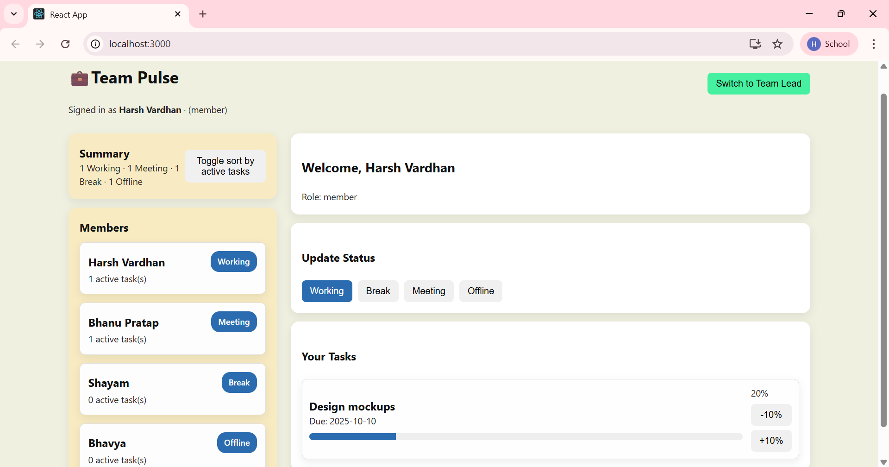
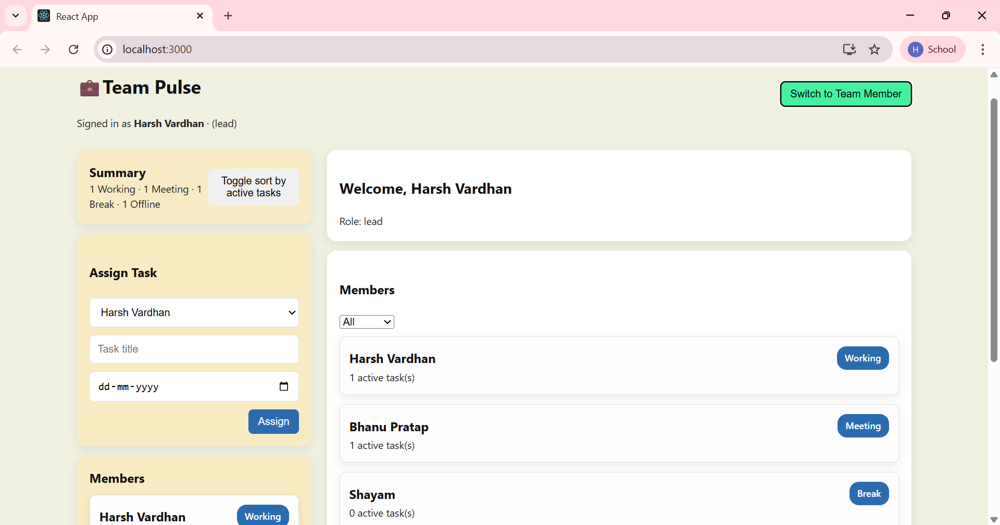
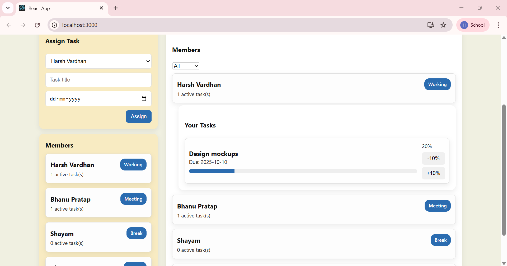

#<h1> 🧑‍🤝‍🧑 Team Pulse Dashboard </h1>

A <h2>Team Pulse Dashboard</h2> — a productivity monitoring tool built with **React**, **Redux Toolkit**.
Monitor team member activity, assign tasks, and track progress with role-based views.

---

## 📌 Project Goal

Build a dashboard that allows:

* **Team Lead**: Monitor team members, assign tasks, filter/sort by status/tasks.
* **Team Member**: Update personal status, view and manage assigned tasks.


## 🧑‍🤝‍🧑 User Roles & Features

### 🔄 Role Switching

* Toggle at top-right to switch between **Team Lead** and **Team Member**.
* Redux state tracks:

```js
currentRole
currentUser
```

### 👨‍💼 Team Lead View

**Monitor Team Member Status**

* Show all members with status badges: `Working | Break | Meeting | Offline`
* Summary count example: `2 Working · 1 Meeting · 1 Break`

**Assign Tasks**

* Form includes:
  * Dropdown to select member
  * Task title input
  * Due date picker
* Submitting updates Redux state.

**Filtering & Sorting**

* Filter members by status
* Sort members by number of active tasks

### 👷 Team Member View

**Update Status**

* Buttons: `Working | Break | Meeting | Offline`
* Only one active at a time → updates global state.

**Manage Tasks**

* See list of assigned tasks
* Each task shows:
  * Title & due date
  * Progress bar (0–100%, adjustable in 10% steps)
  * Mark complete when progress = 100%

---


## 📂Project Structure

```
/src
  /components
    Header.jsx
    MemberCard.jsx
    TaskForm.jsx
    TaskList.jsx
    StatusSelector.jsx
  /redux
    /slices
      membersSlice.js
      roleSlice.js
    store.js
  /pages
    Dashboard.jsx
  App.jsx
  index.js
```

---

## 🛠️ Tech Stack

* **Frontend**: React (with Hooks)
* **State Management**: Redux Toolkit
* **Styling**:  plain CSS
* **Data**: Random dummy data 

---

## 🚀 Setup Instructions

1. **Clone the repository**

```bash
git clone https://github.com/yourusername/team-pulse-dashboard.git
cd team-pulse-dashboard
```

2. **Install dependencies**

```bash
npm install
```

3. **Run the app**

```bash
npm start
```

4. Open [http://localhost:3000](http://localhost:3000) in your browser.

---

## 📸 Screenshots / Demo

*(Add your screenshots below)*






## 📦 Deliverables

* GitHub repo with clean commit history
* Live deployment (Netlify / Vercel)
* README.md with overview, setup instructions, and screenshots
